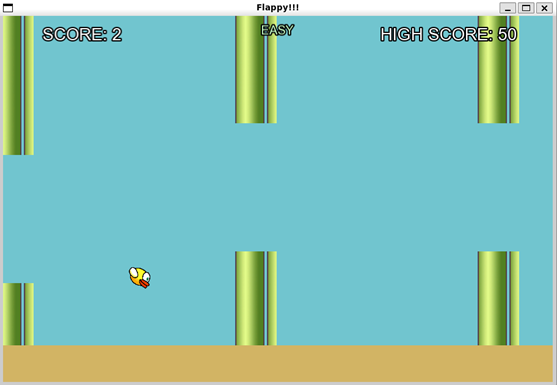
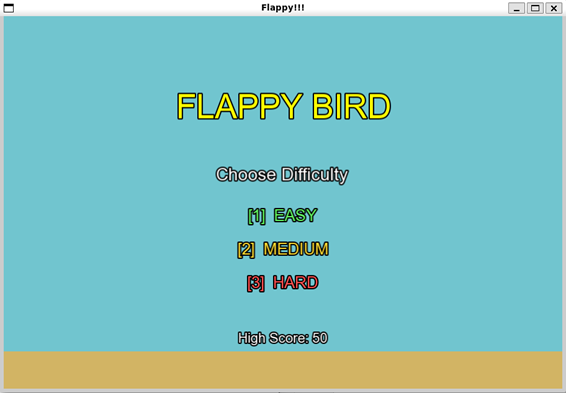
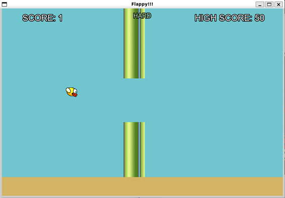
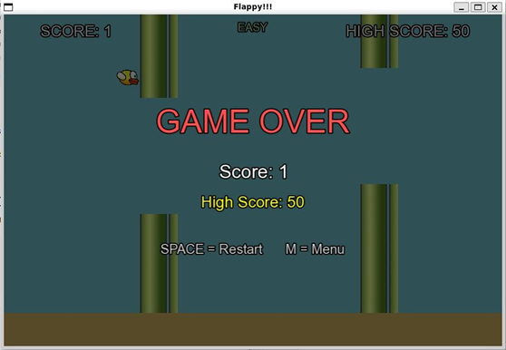

<h1 align="center">🐦 Flappy Bird Game using C++ & SFML</h1>

<p align="center">
Classic Flappy Bird recreated in Modern C++ using SFML.
</p>

<p align="center">


</p>

<p align="center">
  
</p>

---

A modern implementation of the classic **Flappy Bird** game developed in **C++20** using **SFML 3**. The project follows a modular object-oriented architecture and demonstrates real-time game development concepts including physics simulation, collision detection, rendering, resource management, and persistent high-score storage.

---

# 📌 Overview

This project recreates the classic Flappy Bird gameplay while focusing on clean software architecture and modern C++ programming practices.

The game features a fixed time-step update loop, smooth gameplay mechanics, automatic asset discovery, and a persistent high-score system built using file handling.

---

# ✨ Features

* 🐦 Realistic bird movement with gravity and flap mechanics
* 🚧 Procedurally generated pipe obstacles
* 💥 Accurate collision detection system
* 🏆 Persistent high-score saving
* 📱 Responsive fullscreen layout
* ⚡ Fixed timestep game loop (120 updates/sec)
* 🧩 Modular object-oriented architecture
* 📂 Automatic asset discovery using C++ filesystem
* 🎨 Sprite-based rendering using SFML
* 🖥️ Cross-platform friendly source code

---

# 🛠️ Technologies Used

| Technology | Version   | Purpose                   |
| ---------- | --------- | ------------------------- |
| C++        | C++20     | Programming Language      |
| **SFML**   | **3.0.2** | Graphics & Window Library |
| GNU Make   | Latest    | Build System              |
| MSYS2      | MinGW64   | Development Environment   |
| Git        | Latest    | Version Control           |


---

# 📁 Project Structure

```text
flappy-bird-sfml
│
├── assets/
│   ├── Bird.png
│   └── Pipes.png
│
├── screenshots/
│   ├── Output-1.png
│   ├── Output-2.png
│   ├── Output-3.png
│   └── Output-4.png
│
├── Bird.cpp
├── Bird.hpp
├── Game.cpp
├── Game.hpp
├── HighScore.cpp
├── HighScore.hpp
├── PipeSystem.cpp
├── PipeSystem.hpp
├── main.cpp
│
├── Makefile
├── Makefile.vs
├── highscore.txt
├── README.md
├── LICENSE
└── .gitignore
```

---

# 🎮 Controls

| Key       | Action       |
| --------- | ------------ |
| **Space** | Flap         |
| **R**     | Restart Game |
| **Esc**   | Exit         |

---

# 📸 Screenshots

### Main Menu



---

### Gameplay


---

### Collision & Score



---

### Game Over



---

# 🚀 Build Instructions

This project has been tested using **MSYS2 MinGW64** and **SFML 3.0.2** on Windows.

## Requirements

* C++20 compatible compiler
* SFML 3.x
* GNU Make
* MSYS2 MinGW64 (Windows)

## Build

```bash
make
```

## Run

```bash
./flappy-bird
```

## Clean

```bash
make clean
```

---

# 💡 Concepts Demonstrated

* Object-Oriented Programming (OOP)
* Real-Time Game Loop
* Collision Detection
* Game Physics
* Resource Management
* File Handling
* Persistent High-Score System
* Modern C++20 Features
* Build Automation using GNU Make

---

# 🔮 Future Improvements

* Multiple Difficulty Levels
* Background Music
* Sound Effects
* Pause Menu
* Animated Background
* Power-ups
* Better UI/UX
* Cross-platform Packaging
* Settings Menu

---

# 👨‍💻 Author

**Pratik Panda**

B.Tech – Computer Science & Engineering
Institute of Technical Education and Research (ITER), SOA University

GitHub: [Pratik-098](https://github.com/Pratik-098)

---

# 📄 License

This project is licensed under the **MIT License**.
